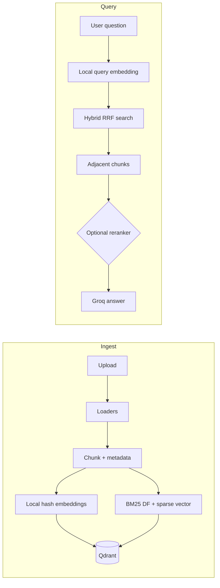

# GCP production RAG service

This project implements the **production-grade RAG techniques** described in [Designing a Production-Grade RAG Architecture](https://levelup.gitconnected.com/designing-a-production-grade-rag-architecture-bee5a4e4d9aa) and mirrored in the open reference implementation [matt-bentley/LLM-RAG-Architecture](https://github.com/matt-bentley/LLM-RAG-Architecture):

| Technique | Implementation here |
|-----------|---------------------|
| Hybrid retrieval (dense + BM25 sparse) | Qdrant named vectors + prefetch + **RRF fusion** |
| Adjacent chunk expansion | Fetches neighboring `chunkIndex` for continuity |
| Cross-encoder reranking | Optional HTTP service (same `/rerank` API as the reference reranker) |
| Chunking + metadata for citations | tiktoken-sized chunks with `sourceDocument`, `sectionPath`, pages |
| Embeddings + grounded answers | Local hash embeddings + **Groq** chat completions |

**Multi-format ingestion** (beyond the reference’s PDF-only demo): PDF (text + tables via pdfplumber), DOCX (paragraphs + tables), CSV / Excel, plain text and Markdown.

## Architecture



## Quick start (local)

1. Start Qdrant: `docker run -p 6333:6333 qdrant/qdrant`
2. Copy `.env.example` to `.env` and set `GROQ_API_KEY`.
3. Create a virtualenv, install deps: `pip install -r requirements.txt`
4. Run: `uvicorn app.main:app --reload --port 8080`

Optional reranker (heavy image): `docker compose --profile rerank up` and set `RERANKER_ENABLED=true`, `RERANKER_URL=http://localhost:8000`.

## Web UI

Open **`/`** (redirects) or **`/ui/`** in the browser: upload documents, chat, and view **source citations** below each answer.

## API

- `POST /v1/ingest` — multipart file upload (PDF, DOCX, CSV, XLSX, TXT, MD, …)
- `POST /v1/query` — JSON `{ "question": "...", "top_k": 5 }`
- `DELETE /v1/documents/{name}` — remove all points for `sourceDocument`
- `GET /health` - Qdrant + Groq + reranker checks

## GCP production (Cloud Run + Managed Qdrant)

Use **Qdrant Cloud** (or another managed Qdrant) as the vector store; set **`QDRANT_URL`** to the cluster HTTPS URL and **`QDRANT_API_KEY`**.

Full steps (Secret Manager, Artifact Registry, Terraform, IAM, env vars): see **`deploy/README.md`**.

Terraform lives in **`deploy/terraform/`** (`terraform.tfvars.example` -> `terraform.tfvars`). It provisions a **Cloud Run v2** service, injects **`QDRANT_API_KEY`** and **`GROQ_API_KEY`** from Secret Manager, sets **`PRODUCTION_MODE=true`** (blocks in-memory Qdrant), and disables **`/docs`** by default.

Legacy one-off build: `gcloud builds submit --tag REGION-docker.pkg.dev/PROJECT/rag/gcp-rag-app:latest .` from `gcp-rag-app/`.

For **BM25** statistics across Cloud Run revisions, plan a durable **`BM25_STATE_PATH`** (volume or GCS sync); see `deploy/README.md`.

## Testing

**Regression (pytest, mocked RAG - no Groq/Qdrant billable calls on `/v1/*`):**

```bash
pip install -r requirements-dev.txt
pytest tests -v
```

**Stress — async harness (default: `/health` only, safe for production URL):**

```bash
python stress/async_stress.py --url https://YOUR-SERVICE.run.app --concurrency 40 --requests 100
```

Add `--hit-query` only against a disposable environment (each call runs **Groq** + **Qdrant**).

**Stress — Locust (Web UI):**

```bash
set LOCUST_API_KEY=optional-key
locust -f stress/locustfile.py --host=https://YOUR-SERVICE.run.app
```

## Notes

- Re-ingesting the same logical document without `DELETE` first can skew BM25 document frequencies; delete the document name before re-indexing for clean statistics.
- Keep `EMBEDDING_DIMENSIONS=384` unless you replace the local embedding implementation.
